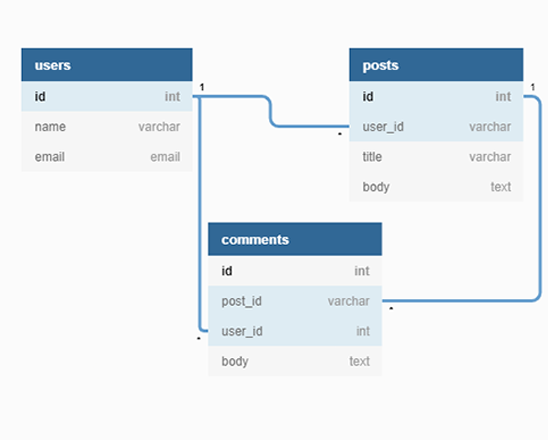

# Micro Reddit

[]()
[]()
[]()

<br />
<p align="center">
  <h3 align="center">Terminal program based on Reddit functionality<h3>
  <p align="center">
    <a href="https://github.com/ElijahTobs/Micro-Reddit/"><strong>Explore the docs »</strong></a>
    <br />
    <br />
    -
    <a href="https://github.com/ElijahTobs/Micro-Reddit/issues">Report Bug</a>
    -
    <a href="https://github.com/ElijahTobs/Micro-Reddit/pulls">Request Feature</a>
    -
  </p>
</p>
    
## Content

<p align="center">
  <a href="#about">About</a> •
  <a href="#with">Built With</a> •
  <a href="#database">Database Model</a> •
  <a href="#setup">Setup</a> •
  <a href="#howto">Setup</a> •
  <a href="#authors">Authors</a> •
</p>

## About <a name = "about"></a>

In this project, the authors have the goal of practicing ActiveRecord methods, building a micro software that simulates Reddit funcionalities and runs on rails console.

## 🔧 Built with <a name = "with"></a>

- Ruby 2.7.1
- Rails 5.2.4.3

## Database Model <a name = "database"></a>




## 🛠 Setup <a name = "setup"></a>

```
$ cd <folder>
$ git clone
$ cd Micro-reddit
$ bundle install
$ rails db:migrate
```

## 📝 How to use <a name = "howto"></a>

To create Users, Posts or Comments, run the commands on rails console:

```
$ rails console
...

```

## ✒️ Authors <a name = "authors"></a>

👤 **Lucas Delbel**

- Github: [@ldelbel](https://github.com/ldelbel)
- Twitter: [@delbel_lucas](https://twitter.com/delbel_lucas)
- Linkedin: [lucasdelbel](https://www.linkedin.com/in/lucasdelbel/)

👤 **Elijah Ayandokun**

- Github: [@ElijahTobs](https://github.com/ElijahTobs)
- Twitter: [@Elijahgr8](https://twitter.com/Elijahgr8)
- Linkedin: [linkedin](https://linkedin.com/in/ayandokunelijah)

## 🤝 Contributing

Contributions, issues and feature requests are welcome!

Feel free to check the [issues page](https://github.com/ElijahTobs/Micro-Reddit/issues).

## 👍 Show your support

Give a ⭐️ if you like this project!

## :clap: Acknowledgements

- Microverse: [@microverse](https://www.microverse.org/)

